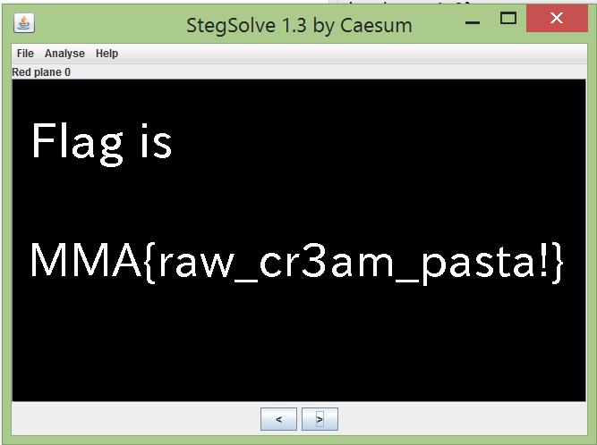

# Nagoya Castle - 100
This is the file: [problem.png](kapifiles/problem.png)

By using [Stegsolve.jar](http://www.caesum.com/handbook/Stegsolve.jar) I found the flag stored in red plane zero.

The flag was:
* MMA{raw_cr3am_pasta@}
