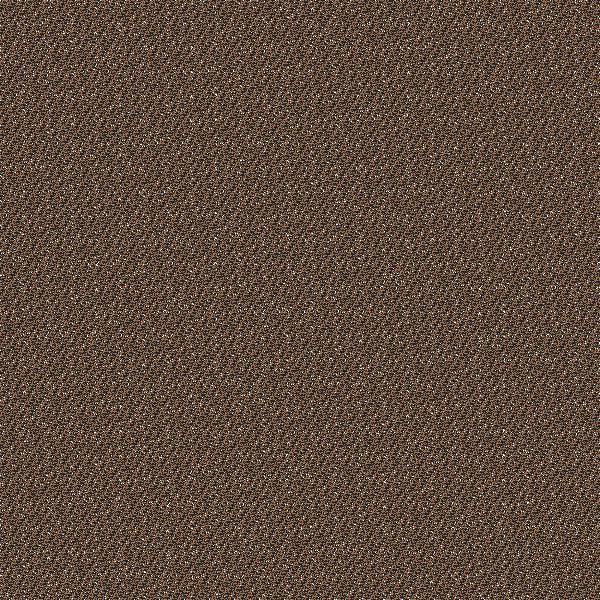
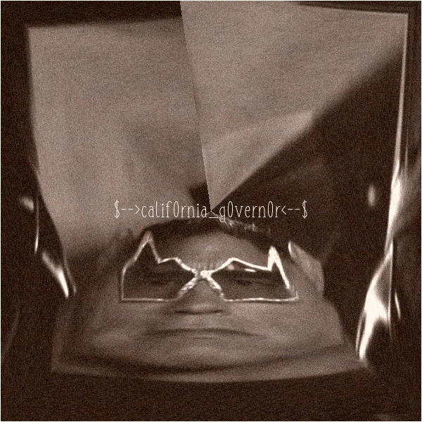

# You Have Been Terminated - 50
They gave us an image 

And also gave us 2 hits:
```
Hint 1: I heard a cat... Hint 2: There are multiple implementations of this algorithm
```
After searching and trying for hours we found that the algorithm which has been used to transform this image was call (Arnold’s Cat Map)[https://en.wikipedia.org/wiki/Arnold%27s_cat_map]

```python
import PIL.Image
from numpy import *

im = PIL.Image.open("o.jpg")
width, height = im.size
N = width

x,y = meshgrid(range(N),range(N))
newX = (2*x+y) % N
newY = (x+y) % N

for i in xrange(N+1):
	if i == 0:
		im_arr = array(im)[newX,newY]
	else:
		im_arr = im_arr[newX,newY]
	result = PIL.Image.fromarray(im_arr)
	result.save("solve"+str(i)+".png")
 ```
 We implement the algorithm and got the flag.


Ref: (Arnold Cat)[https://github.com/zhanxw/cat/]