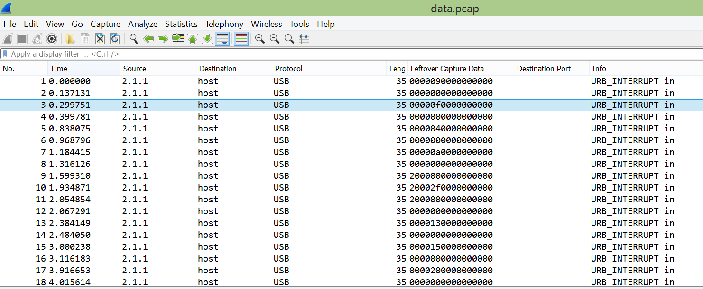

# Just Keyp Trying - 80
Problem:
```
Here's an interesting capture of some data. But what exactly is this data? Take a look: data.pcap
```
This is the data file they gave us: [data.pcap](kapifiles/data.pcap)

Hints:
```
- Find out what kind of packets these are. What does the info column say in Wireshark/Cloudshark?
- What changes between packets? What does that data look like?
- Maybe take a look at http://www.usb.org/developers/hidpage/Hut1_12v2.pdf?
```

In the pcap file we noticed that "Leftover Capture Data" was change between packets. We extrat all of them 
Then we map the value that changed with values in the table of keycode of USB keyboard [USB keyboard keycode](http://www.usb.org/developers/hidpage/Hut1_12v2.pdf).
```
00 09 f,F >> f
00 0f l,L >> l
00 04 a,A >> a
00 0a g,G >> g
20 2f [,{ >> {
00 13 p,P >> p
00 15 r,R >> r
00 20 3,# >> 3
00 22 5,% >> 5
00 22 5,% >> 5
20 2d -,_ >> _
00 27 0,) >> 0
00 11 n,N >> n
00 1a w,W >> w
00 04 a,A >> a
00 15 r,R >> r
00 07 d,D >> d
00 16 s,S >> s
20 2d -,_ >> _
00 20 3,# >> 3
00 04 a,A >> a
00 1e 1,! >> 1
00 27 0,) >> 0
00 1e 1,! >> 1
00 20 3,# >> 3
00 21 4,$ >> 4
00 08 e,E >> e
20 30 ],} >> }
01 06 c,C >> 

flag{pr355_0nwards_3a10134e}
```
The flag was:
* flag{pr355_0nwards_3a10134e}