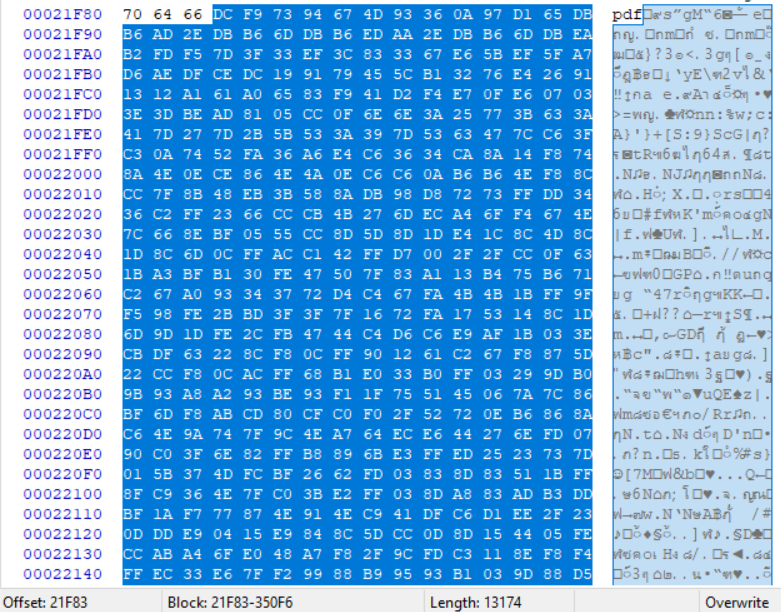
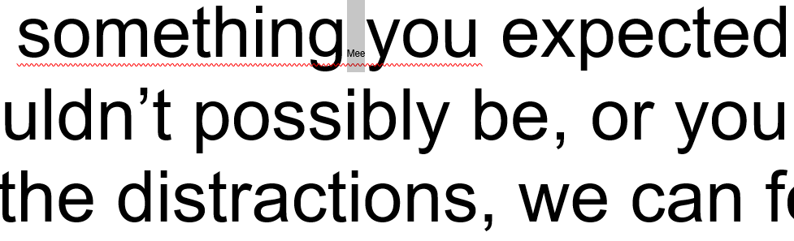

# __White Snow, Black Shadow - 100__
The challenge is here: [link](files/evidence.jpg)

> Finally we caught the image in criminal communication. But Holmes, why are they crying?


* strings evidence.jpg

got message.pdf

* binwalk evidence.jpg
```
DECIMAL       HEXADECIMAL     DESCRIPTION
--------------------------------------------------------------------------------
0             0x0             JPEG image data, JFIF standard 1.01
30            0x1E            TIFF image data, big-endian, offset of first image directory: 8
217428        0x35154         End of Zip archive
```

Open evidence.jpg in HxD editor find for the end of JPEG file which is **\xff\xd9** at offset **\x21F58** then at offset **\x21F5A** found starting of **PK\x05\x06**

* https://users.cs.jmu.edu/buchhofp/forensics/formats/pkzip.html (Good reference)
* http://jon.glass/blog/has-fun-with-zlib/ (Good guide)

* Extract compressed data from JPEG
	* 21F5Ah - 21F82h: starting of ZIP file and its local file header
	* 21f83h - 350F6h: its compressed data
	* 350F7h - EOF: Central Directory File Header



After extract data between **21f83h - 350F6h** I wrote a python to decompress Deflated data 
```python
import zlib,sys

# Usage: python solve.py compressed_data_file output_file

def inflate(compressed_data2):
	# -15 for the window buffer will make it ignore headers/footers
	zlibbed_data2 = zlib.decompress(compressed_data2, -15)
	return zlibbed_data2

with open(sys.argv[1], "r+b") as read_compressed_file:
	file_data_to_be_uncompressed = read_compressed_file.read()
read_compressed_file.closed


uncompressed_file = inflate(file_data_to_be_uncompressed)

with open(sys.argv[2], 'w') as make_file:
	make_file.write(uncompressed_file)
make_file.closed
```

The message.pdf did not contains explicit flag but the flag was hidden in very small text between space bar.

* Copy all text into MS Word and I noticed that small text



```
somethingMeeyou
whatPwnremains
oneCTFof
a{T3challenging
lotsxt_of
sometimesUndwe
that3r_intrigues
botht3Xobvious
wet!!!!}work

MeePwnCTF{T3xt_Und3r_t3Xt!!!!}
```

> MeePwnCTF{T3xt_Und3r_t3Xt!!!!}
