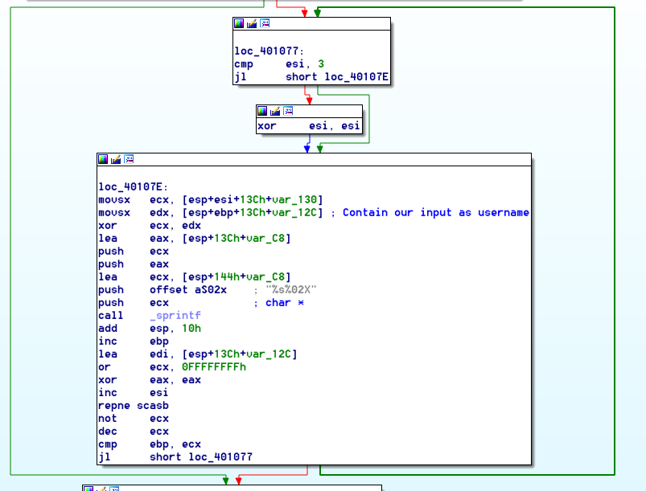

# __Easy Keygen - 100__
When I access to the challenge on [reversing.kr](http://reversing.kr/) they gave us a ZIP file called Easy_KeygenMe.zip.

Attachment: [Easy_KeygenMe.zip](Easy_KeygenMe.zip)

* Easy Keygen.exe
* ReadMe.txt

ReadMe.txt gave me some hint:
```
ReversingKr KeygenMe


Find the Name when the Serial is 5B134977135E7D13

```

So the purpose of this challenge is to find username coresponding the that key.

I review an assembly of the program by using IDA pro. I noticed the program flow as follow:
1. The program recieve an input as username
2. It generate the key according to the username (But still don't know how the key was generated.)
3. It recieve an input as serial key and compare that key with the generated one.
4. Return the result.

After reviewing assembly code again I found that the code that used to generated serial key began at loc_401077.



The logic is simple, the program just recieve user input as username and then XOR each characters in the username with value from an array. The array was constructed at 0x401042.
```
mov     [esp+140h+var_130], 10h
mov     [esp+140h+var_12F], 20h
mov     [esp+140h+var_12E], 30h
```

The array contains just 0x10, 0x20, and 0x30 which is 16, 32, and 48 in decimal.

Now I knew that how the program generate the key then I started reverse the key generation process by using provided key and find the username coresponding the the key.

* The key is: 5B134977135E7D13

The reverse process is just XOR all key with the value in the array
```
5B 13 49 77 13 5E 7D 13
XOR with
10 20 30 10 20 30 10 20

4b 33 79 67 33 6e 6d 33
=======================
```

Translate the result from HEX into ASCII then I got flag: K3yg3nm3

* Flag:

> K3yg3nm3
