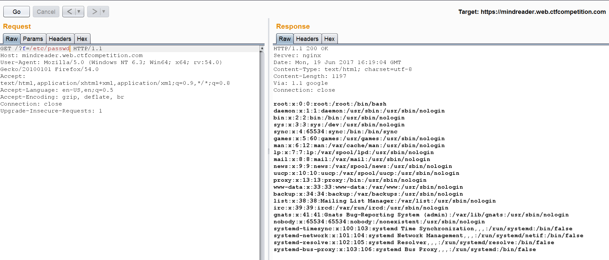
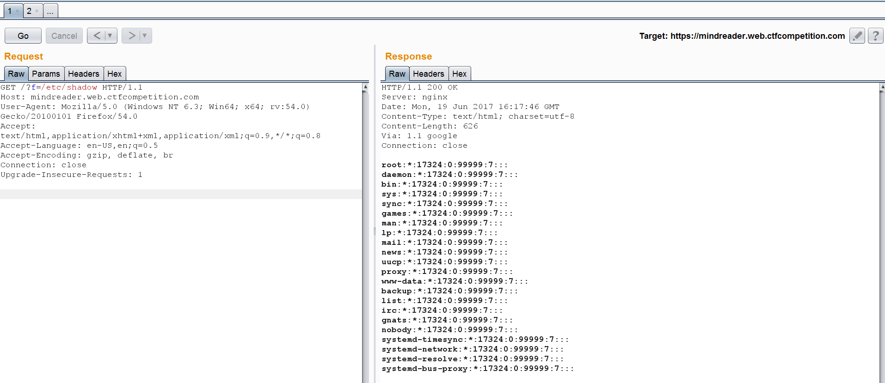
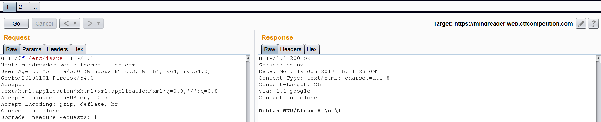
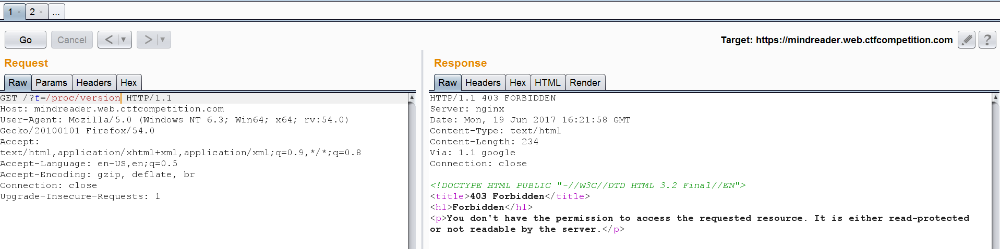
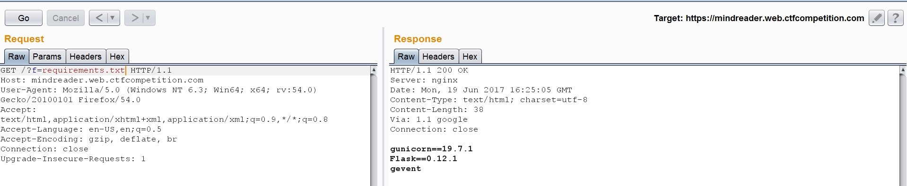
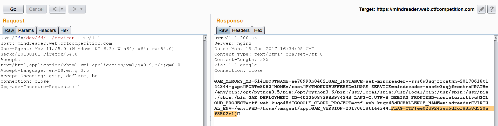

# mindreader - 50
This is about web and they gave us some hints:
> Can you read my mind?
> Challenge running at https://mindreader.web.ctfcompetition.com/

At first glance there are no comment or hidden code. After checking an input, LFI was found.

Try to read /etc/passwd and /etc/shadow




Try to enumerate OS information by reading files /etc/issue and /proc/version


But for /proc/version there is some restriction


Try to enumerate web platform by reading many defaul files and got requirements.txt was informative.


We knew that the web use python with Flask then try to enumerate main files of Flask application which could be any simple python extension file such as app.py, index.py, main.py blah..blah.. then you might got main.py.
```python
from flask import Flask, request, abort
import re
import os
import logging

assert os.environ['FLAG']

app = Flask(__name__)

INDEX = open('index.html').read()

HALL_OF_SHAME = []

@app.route('/')
def index():
    for ip in request.headers.get('X-Forwarded-For', '').split(','):
        ip = ip.strip().lower()
        if ip in HALL_OF_SHAME:
            abort(403)

    if 'f' in request.args:
        try:
            f = request.args['f']
            if re.search(r'proc|random|zero|stdout|stderr', f):
                abort(403)
            elif '\x00' in f:
                abort(404)
            return open(f).read(4096)
        except IOError:
            abort(404)
    else:
        return INDEX
```

The code indicates that flag is stored in system environment then you may obtain environment variable value by reading file /proc/self/environ but don't forget that accessing /proc was prohibited. 

Trickly read file in /proc by accessing /dev instead. Because /dev/fd is a symlink to /proc/self/fd, if you specify /dev/fd/../environ that could mean /proc/self/fd/../environ ?

Let's try.


The flag was:
* CTF{ee02d9243ed6dfcf83b8d520af8502e1}
